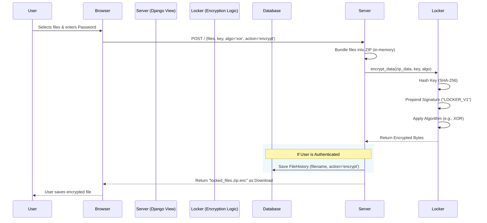
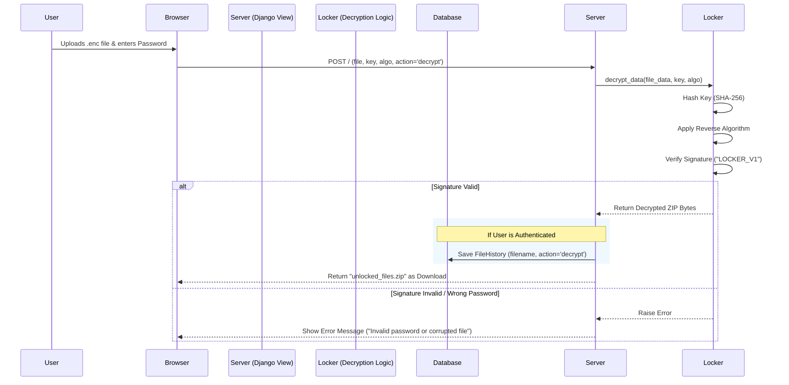

# File Encryption & Decryption Workflow

This document explains how the file encryption and decryption process works in your application.

## 1. High-Level Overview

The application uses a symmetric encryption approach where the same key (password) is used for both locking and unlocking files. To handle multiple files easily, it automatically bundles them into a ZIP archive before encryption.

## 2. Encryption Workflow

When a user uploads files to be encrypted:

### Detailed Steps:
1.  **Input**: User selects one or multiple files and provides a password (key).
2.  **Zipping**: The server takes all uploaded files and compresses them into a single ZIP file in memory. This ensures that even if you upload 10 files, you only get 1 encrypted file back.
3.  **Key Hashing**: The password provided is hashed using SHA-256. This is a security best practice so the raw password isn't used directly, and it ensures a fixed-length key.
4.  **Signature**: A special marker `LOCKER_V1` is added to the beginning of the data. This acts like a stamp to verify later that the file was indeed encrypted by this system and with the correct password.
5.  **Encryption**: The selected algorithm (XOR, Base64, or both) transforms the data into an unreadable format.
6.  **Output**: The user downloads a single `.enc` file.

## 3. Decryption Workflow

When a user uploads an encrypted file to be decrypted:

### Detailed Steps:
1.  **Input**: User uploads the `.enc` file and enters the same password used for encryption.
2.  **Processing**: The server reads the encrypted file.
3.  **Decryption**: The system attempts to reverse the encryption using the provided key and algorithm.
4.  **Verification**: It checks for the `LOCKER_V1` signature.
    *   **Success**: If the signature is found, it means the password was correct. The signature is removed, and the original ZIP data is restored.
    *   **Failure**: If the signature is missing or garbage, it means the wrong password was used or the file is corrupted. The process stops and shows an error.
5.  **Output**: The user receives the original `unlocked_files.zip` containing their data.

## 4. Key Code Components

*   **`locker_app/views.py`**: Handles the web request, zipping files, and managing the HTTP response.
*   **`locker_app/locker.py`**: Contains the core logic for `encrypt_data` and `decrypt_data`, including the math for XOR and Base64 operations.
